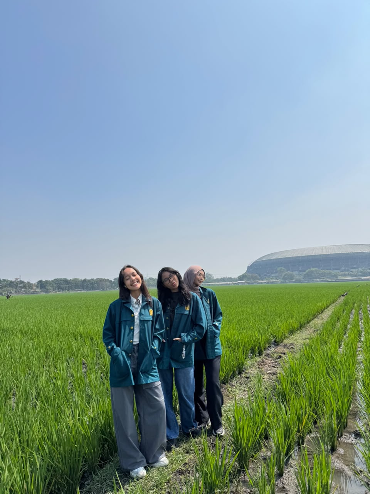
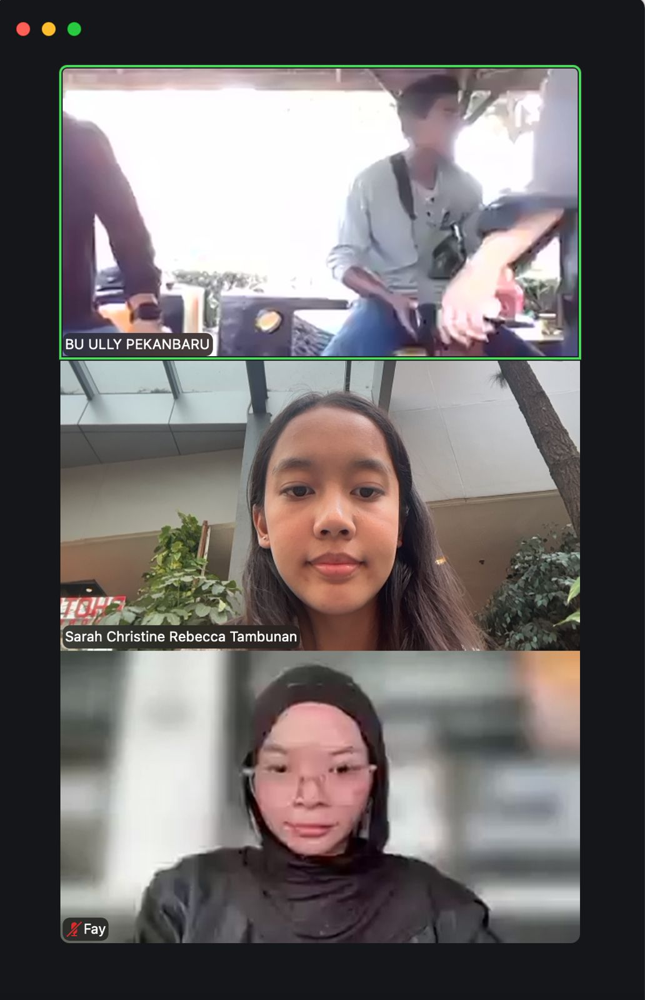

## Kompetensi target

Membedakan person, personality, dan character serta memilih objective, repertoire, dan language yang sesuai.

## Evidence wajib

- Lima character dari sedikitnya tiga domain kehidupan.
- Objective, responsibility, repertoire, dan risiko tiap character.
- Satu contoh perubahan language ketika character berubah.

## Lima character

| Domain dan character | Person & relationship | Objective & responsibility | Repertoire & language | Risiko dan latihan |
| :--- | :--- | :--- | :--- | :--- |
| **Intra-Self — penjaga keseimbangan** | Diri sendiri saat menyeimbangkan akademik, karier, organisasi, dan lomba | Mengatur prioritas, jujur pada kapasitas diri, dan mengevaluasi beban kerja secara rutin agar tidak *burnout* | Refleksi mingguan dan self-talk jujur; "Apa yang minggu ini paling membuatku lelah, dan apakah aku masih punya energi untuk menerima tanggung jawab baru?" | Terlalu cepat menerima tanggung jawab baru dan memendam tekanan; latihan: refleksi 15 menit setiap minggu sebelum menyanggupi komitmen baru |
| **Family — anak bungsu** | Orang tua dan kakak | Menjaga kedekatan dan tidak hanya menceritakan hal baik agar keluarga benar-benar tahu kondisi saya | Hangat dan terbuka; "Minggu ini aku lagi banyak tugas dan agak capek, tapi aku lagi coba atur. Boleh aku cerita sebentar?" | Menyembunyikan kesulitan agar keluarga tidak khawatir; latihan: menceritakan satu kesulitan nyata setiap kali berbincang dengan keluarga |
| **Friends — sahabat pendengar** | Teman-teman dekat yang datang untuk bercerita | Membuat teman merasa didengar, divalidasi, dan tidak sendirian | Mendengarkan aktif, parafrasa, pertanyaan reflektif; "Kamu mau didengarkan dulu, dibantu mikir, atau mau saran dariku?" | Terlalu cepat memberi saran, termasuk lewat pertanyaan seperti "kenapa nggak…?"; latihan: menahan saran selama 3 menit pertama |
| **Work — CTO Neurova** | Tim teknis dan rekan founder dari SBM ITB | Menerjemahkan visi produk menjadi eksekusi teknis, mengoordinasi tim, dan melaporkan progres secara akurat dan tepat waktu | Terstruktur, berbasis data, memberi opsi dan *trade-off*; "Untuk demo, versi sederhana fitur ini bisa selesai tiga hari; versi lengkapnya butuh dua minggu. Mana yang lebih mendukung target kita?" | Menanggung beban teknis sendiri dan tidak menyampaikan batas kemampuan; latihan: menyampaikan kapasitas dan kebutuhan bantuan di setiap rapat progres |
| **Community — Team Leader tim lomba (BURU-BURU, GEMASTIK)** | Dua rekan satu tim lomba desain UX | Mengarahkan riset dan desain, menjaga ritme kerja, dan memastikan tim mencapai tenggat lomba | Fasilitatif dan terstruktur; "Minggu ini kondisi masing-masing gimana? Bagian mana yang realistis selesai sebelum tenggat?" | Mengambil alih pekerjaan anggota daripada membicarakannya; latihan: *check-in* kapasitas anggota setiap minggu sebelum membagi tugas |

## Episode yang dianalisis

**Konteks:** Tim lomba BURU-BURU (proyek NUSATANI, GEMASTIK XIX) yang saya pimpin mengalami kemunduran *timeline*. Faktanya, beberapa *milestone* internal terlewat dan sejumlah bagian baru dikerjakan mendekati tenggat pengumpulan, sementara komunikasi di grup tim menjadi jarang karena setiap anggota sibuk dengan tugas kuliah dan kegiatan lain. Awalnya muncul *story* dalam diri saya: "Kalau semua sibuk, lebih cepat kalau aku kerjakan sendiri saja," dan "Kalau aku menegur, nanti aku dianggap terlalu menekan." Keduanya adalah asumsi, bukan fakta, karena saya belum pernah menanyakan langsung kondisi setiap anggota.

**Objective:** Mengembalikan komunikasi tim yang terbuka, memetakan kapasitas nyata setiap anggota, dan menyepakati *timeline* baru yang realistis tanpa saya menanggung semua pekerjaan sendiri.

> **Saya:** "Teman-teman, aku sadar *timeline* kita mundur cukup jauh dan beberapa bagian jadi mepet deadline. Aku juga ngaku, aku sempat kepikiran buat ngerjain semuanya sendiri, padahal itu bukan solusi. Boleh kita cerita dulu kondisi masing-masing minggu ini?"  
> **Rekan 1:** "Jujur minggu ini aku lagi banyak kuis dan praktikum, jadi bagianku belum kesentuh."  
> **Rekan 2:** "Aku sebenarnya bisa, tapi aku nggak yakin bagianku harus sampai mana, jadi nunggu kabar."  
> **Saya:** "Oke, jadi masalahnya bukan cuma sibuk, tapi juga kita kurang jelas soal pembagian dan jarang saling update, betul begitu? Gimana kalau tugas yang tersisa kita pecah jadi bagian kecil dengan tenggat per bagian, terus kita rutin update singkat di grup?"  
> **Rekan 1:** "Setuju, tapi bagianku boleh digeser ke setelah kuis selesai?"  
> **Saya:** "Boleh. Kalau begitu bagian yang paling mendesak aku ambil dulu minggu ini, nanti kamu lanjut bagianmu setelah kuis."

*Dialog di atas adalah rekonstruksi dari ingatan saya.*

Respons anggota mengubah *repertoire* saya dari menanggung beban sendiri dan menahan teguran menjadi bertanya, merangkum, lalu menawarkan pembagian ulang. Informasi dari Rekan 2 menunjukkan bahwa sebagian keterlambatan bukan karena kurang niat, tetapi karena instruksi saya sebagai ketua kurang jelas. *Agreement* akhirnya: tugas tersisa dipecah menjadi bagian kecil dengan penanggung jawab dan tenggat masing-masing, anggota yang sedang menghadapi kuis mendapat tenggat setelah kuisnya selesai, saya mengambil bagian yang paling mendesak, dan tim sepakat memberi *update* singkat secara rutin di grup.

## Perubahan language

Sebagai **sahabat pendengar**, saya akan berkata, "Kamu mau didengarkan dulu, dibantu mikir, atau mau saran dariku?" dengan nada hangat, santai, dan lebih banyak memberi ruang daripada berbicara. Sebagai **CTO Neurova**, saya berkata, "Minggu ini kapasitas saya terbatas karena ada dua tenggat bersamaan. Bagian integrasi bisa saya selesaikan, tetapi *testing* perlu dibantu. Siapa yang bisa mengambil bagian itu?" dengan bahasa yang terstruktur, tegas, dan berorientasi hasil. *Core care* tetap sama, yaitu tanggung jawab dan kepedulian pada orang lain, tetapi *responsibility* dan *action* berbeda. Sebagai sahabat, saya bertanggung jawab atas rasa aman teman saat bercerita. Sebagai CTO, saya bertanggung jawab atas kelancaran produk, termasuk dengan jujur menyampaikan batas kemampuan saya sendiri.

## Konteks performance

**Tanggal dan setting:** Agustus–September 2026, selama pengerjaan proyek NUSATANI untuk GEMASTIK XIX kategori desain UX. Rangkaian kegiatan meliputi observasi lapangan di area persawahan (7 Agustus 2026) dan wawancara daring dengan narasumber riset pengguna (9 Agustus 2026). Diskusi tim tentang kemunduran *timeline* terjadi setelah tahap riset tersebut, ketika progres pengembangan desain mulai melambat.

**Persons dan relationship:** Saya sebagai Team Leader tim BURU-BURU bersama dua rekan satu tim (F. dan satu rekan lainnya). Kami adalah teman sesama mahasiswa ITB yang dalam proyek ini memiliki relasi kerja sebagai ketua dan anggota tim. Nama narasumber tidak dicantumkan untuk menjaga privasi.

**Objective dan initial state:** *State* awal: setelah tahap riset lapangan dan wawancara pada awal Agustus, progres tim melambat karena setiap anggota sibuk dengan perkuliahan dan kegiatan lain. Beberapa *milestone* internal terlewat, komunikasi di grup menjadi jarang, dan sejumlah bagian baru dikerjakan mendekati tenggat. *State* yang ingin dicapai: komunikasi tim kembali terbuka, kapasitas setiap anggota diketahui, dan tugas tersisa terbagi dengan tenggat yang realistis tanpa saya menanggung semuanya sendiri.

## Evidence

::: {.evidence-block}

Kedua dokumentasi ini menunjukkan rangkaian kerja tim pada tahap riset sebelum *timeline* mundur. Kontribusi saya sebagai Team Leader: mengoordinasikan jadwal observasi dan wawancara, memimpin diskusi tim, serta menginisiasi pembagian ulang tugas ketika *timeline* mundur.
:::

## Analisis komunikasi

| Elemen | Evidence dan analisis |
|---|---|
| Person & character | Rekan tim diposisikan sebagai *person* dengan beban dan kendala masing-masing, bukan dilabeli "tidak bertanggung jawab". Terjadi pergeseran *power*: sebagai Team Leader saya memegang posisi yang menentukan arah kerja, tetapi saya memilih membuka diri lebih dulu dengan mengakui dorongan saya untuk mengerjakan semuanya sendiri. Pengakuan ini menurunkan jarak antara ketua dan anggota sehingga anggota merasa aman untuk jujur tentang kondisinya. |
| Objective & state | Ada *objective* yang saling bersaing: saya sebagai ketua ingin *timeline* lomba kembali terkejar, sementara anggota perlu menyelesaikan kuis dan praktikum agar tidak kewalahan. Kecenderungan pribadi saya untuk memendam tekanan juga bersaing dengan tuntutan peran ketua untuk terbuka. *State* berubah dari progres yang mandek dan komunikasi yang sepi menjadi pembagian tugas yang jelas dengan tenggat per bagian. |
| Repertoire & language | Saya beralih dari *repertoire* menanggung sendiri dan menahan teguran menjadi *self-disclosure*, pertanyaan terbuka ("Boleh kita cerita dulu kondisi masing-masing minggu ini?"), dan parafrasa ("Jadi masalahnya bukan cuma sibuk, tapi juga pembagian yang kurang jelas, betul begitu?"). Bahasa yang santai tetapi terstruktur membuat diskusi terasa aman sekaligus tetap berorientasi hasil. |
| Response & adaptation | Informasi dari anggota bahwa ia menunggu kejelasan pembagian menunjukkan sebagian keterlambatan berasal dari instruksi saya yang kurang jelas, bukan dari kurangnya niat. Saya langsung menyesuaikan rencana dengan memecah tugas menjadi bagian kecil dan menggeser tenggat anggota yang sedang menghadapi kuis. |
| Agreement/action | Tugas tersisa dipecah menjadi bagian kecil dengan penanggung jawab dan tenggat masing-masing. Setiap anggota mengambil bagian sesuai kapasitasnya. Anggota yang sedang menghadapi kuis mendapat tenggat setelah kuisnya selesai, dan saya mengambil bagian yang paling mendesak. Tim juga sepakat memberi *update* singkat secara rutin di grup agar progres tidak lagi tertinggal tanpa diketahui. |
| Relationship outcome | Konflik terbuka dapat dihindari. Anggota menjadi lebih aktif memberi kabar di grup karena tahu mereka bisa jujur tentang kendala tanpa dihakimi. Bagi saya, episode ini menjadi bukti bahwa menyampaikan keterbatasan sebagai ketua tidak menurunkan kepercayaan tim, justru memperkuatnya. |

## Penggunaan AI

- **Alat dan peran AI:** Claude, untuk membantu menyusun struktur portofolio, merapikan kode Quarto, memberi draf kalimat pada tabel character berdasarkan Lembar Kerja Bab 01, serta menyusun ulang episode dan analisis dari cerita yang saya sampaikan.
- **Prompt atau instruksi penting:** Meminta bantuan mengisi template portofolio Character Map, menyesuaikannya dengan Lembar Kerja Bab 01, dan menyusun episode dari pengalaman saya saat *timeline* tim lomba mundur.
- **Bagian output yang digunakan, diubah, atau ditolak:** Dialog pada episode adalah rekonstruksi dari ingatan saya, lalu saya sesuaikan dengan apa yang benar-benar diucapkan. Draf awal AI menuliskan peran saya sebagai "lead AI dan website", lalu saya ubah menjadi CTO Neurova sesuai peta karakter di Lembar Kerja Bab 01. Saya juga mengganti baris *Community* menjadi Team Leader tim lomba agar sesuai dengan episode yang dianalisis. Contoh episode yang disarankan AI (tenggat bentrok di Neurova) tidak saya gunakan karena saya memilih episode yang benar-benar saya alami di tim lomba.
- **Pemeriksaan accuracy, privacy, dan authority:** Peran dan kecenderungan diambil dari refleksi saya di Lembar Kerja Bab 01. Episode berasal dari pengalaman nyata dan didukung dokumentasi kegiatan tim. Nama rekan ditulis dengan inisial.
- **Apa yang tetap saya pelajari sebagai manusia:** Menyadari kecenderungan saya menanggung semuanya sendiri, memilih kata saat membuka diri kepada tim, dan menilai sendiri apakah hubungan tim benar-benar membaik.

## Feedback dan tindak lanjut

**Feedback yang diterima:** Menurut J., teman yang cukup sering berinteraksi dengan saya, saya sekarang jauh lebih terbuka dan lebih berani menyampaikan apa yang saya inginkan, apa yang tidak saya sukai, serta hal-hal yang membuat saya tidak nyaman.

**Adaptation/replay:** Dalam episode ini, saya tidak lagi diam-diam mengambil alih pekerjaan anggota, tetapi membuka diskusi dengan mengakui kondisi saya dan menanyakan kondisi anggota. Responsnya, anggota mau jujur tentang kendala mereka dan kami menyepakati pembagian ulang yang lebih realistis.

**Next practice:** Selama 4–6 minggu ke depan, saya akan meluangkan setidaknya 15 menit setiap minggu untuk merefleksikan hal yang membuat saya lelah atau kewalahan, lalu menyampaikan setidaknya satu hal tersebut kepada orang yang saya percaya. Sebagai ketua tim, saya juga akan membuka *check-in* kapasitas anggota setiap minggu sebelum *timeline* sempat mundur.

## Self-assessment

| Dimensi | Skor 1–4 | Evidence singkat |
|---|---:|---|
| Person & Character | 4 | Lima character dipetakan; pergeseran *power* ketua saat membuka diri dianalisis eksplisit |
| Objective & State | 4 | *State* awal dan akhir jelas; *objective* yang saling bersaing (target lomba vs beban akademik anggota, kecenderungan memendam vs tuntutan terbuka) dianalisis |
| Repertoire, Language & AI | 3 | *Language* berubah sesuai character; batas penggunaan AI dinyatakan, termasuk bahwa dialog adalah rekonstruksi |
| Response & Adaptation | 3 | Informasi baru dari anggota langsung mengubah pembagian kerja dan tenggat |
| Agreement, Action & Relationship | 3 | Pembagian tugas dan kesepakatan *update* rutin tercatat; bukti percakapan langsung masih terbatas |

**Total:** 17 / 20

::: {.assessor-only}
### Assessment dosen

**Skor:** — / 20  
**Evidence yang mendukung:** —  
**Prioritas perbaikan:** —  
**Keputusan:** Belum dinilai / Perlu revisi / Tercapai
:::

