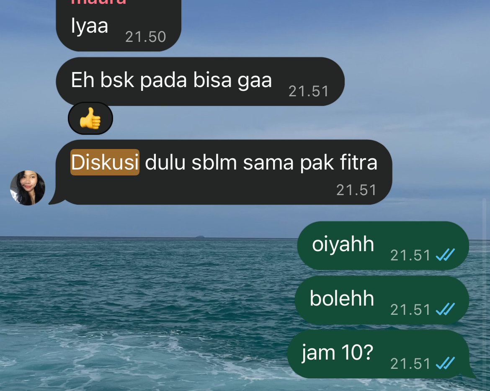
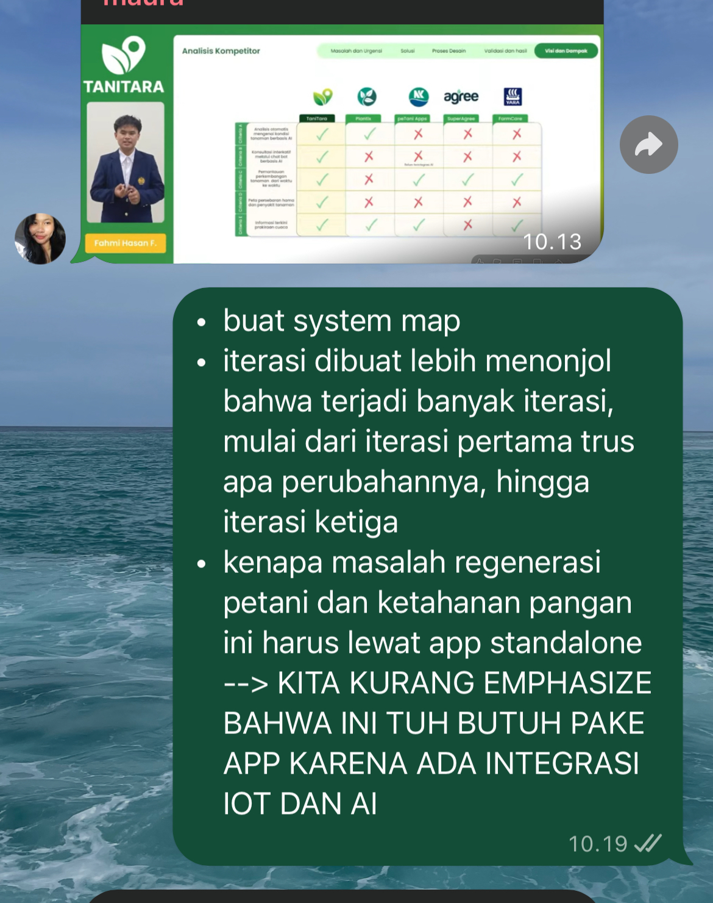

## Kompetensi target

Memisahkan event, fact, story, emotion, internal character, choice, dan action.

## Evidence wajib

- Satu episode komunikasi dengan diri sendiri.
- Initial story dan sedikitnya dua alternative narratives.
- Internal agreement dan bukti tindakan berikutnya.

## Episode

**Event:** Saat mengecek progres tim lomba BURU-BURU (proyek NUSATANI, GEMASTIK XIX), saya melihat beberapa *milestone* internal terlewat, grup tim sepi selama beberapa hari, dan beberapa bagian desain belum dikerjakan padahal tenggat semakin dekat.

| Lapisan | Catatan saya |
| :--- | :--- |
| **Fact** | Beberapa *milestone* internal terlewat; tidak ada *update* di grup selama beberapa hari; anggota tim sedang memiliki kuis dan praktikum; belum ada pembicaraan langsung tentang kendala masing-masing |
| **Initial story** | "Mereka tidak terlalu peduli dengan lomba ini. Kalau aku menegur, nanti aku dianggap terlalu menekan. Lebih cepat kalau aku kerjakan sendiri saja." |
| **Emotion/body signal** | Cemas 7/10, kesal 5/10, lelah 7/10; dada terasa berat, sulit fokus mengerjakan tugas lain, dan ingin langsung membuka file desain untuk mengerjakan semuanya malam itu juga |
| **Reactive character** | *"Solo Fixer"* yang ingin diam-diam mengambil alih pekerjaan anggota dan memendam rasa lelah agar tidak merepotkan orang lain |
| **Desired character** | *"Open Leader"* yang menyampaikan kondisinya secara jujur, menanyakan kapasitas anggota, dan membagi ulang tugas bersama |

*Initial story* melampaui fakta. Faktanya hanya menunjukkan progres melambat dan komunikasi berkurang, bukan bahwa anggota tidak peduli. Saya juga belum pernah menanyakan kondisi mereka, sehingga "mereka tidak peduli" dan "aku akan dianggap menekan" adalah tebakan, bukan evidence.

## Alternative narratives

1. **Shared constraint:** Semua anggota, termasuk saya, sedang menghadapi beban akademik yang padat. Progres melambat karena keterbatasan waktu, bukan karena anggota tidak peduli.
2. **Information gap:** Anggota mungkin menunggu kejelasan dari saya sebagai ketua tentang bagian mana yang harus dikerjakan dan sampai kapan. Grup yang sepi bisa jadi tanda kebingungan, bukan ketidakpedulian.
3. **Leadership cost:** Mengambil alih semua pekerjaan terlihat seperti solusi cepat, tetapi membuat saya kewalahan, menutup kesempatan anggota untuk berkontribusi, dan tidak menyelesaikan akar masalah komunikasi.

Alternatif kedua paling berguna karena sesuai dengan fakta (pembagian tugas belum pernah dibicarakan ulang) dan langsung menghasilkan tindakan yang bisa saya lakukan sebagai ketua, tanpa menyalahkan anggota maupun diri sendiri.

## Internal conversation dan agreement

> **Solo Fixer:** "Udah, nggak usah ribet. Kerjain aja sendiri malam ini, daripada nunggu mereka."  
> **Open Leader:** "Kita belum tahu kenapa mereka diam. Kalau aku kerjain semua, aku yang *burnout* dan masalah komunikasinya tetap ada. Tanya dulu kondisi mereka."  
> **Solo Fixer:** "Tapi kalau aku nanya, nanti kesannya aku nagih dan bikin suasana nggak enak."  
> **Open Leader:** "Nanyanya bisa sambil jujur soal kondisiku juga. Aku juga lagi capek, dan itu wajar disampaikan."  
> **Saya:** "Aku nggak akan langsung ngerjain bagian mereka. Aku tulis dulu faktanya, lalu ajak tim ngobrol soal kondisi masing-masing dan pembagian ulang."

**Internal agreement:** Malam itu juga, saya mengirim pesan ke grup tim untuk mengajak diskusi singkat tentang kondisi masing-masing dan pembagian ulang tugas. Saya juga berkomitmen tidak mengerjakan bagian anggota lain sebelum diskusi itu terjadi. Sejak episode ini, saya menjadikan pola tersebut sebagai aturan pribadi: ketika pekerjaan tim menumpuk, saya memilih berdiskusi dan membagikan pemikiran saya kepada tim, bukan menyelesaikannya sendiri secara diam-diam.

## Konteks performance

**Tanggal dan setting:** Agustus 2026, setelah tahap riset lapangan dan wawancara pengguna proyek NUSATANI selesai. Refleksi dilakukan secara mandiri saat saya mengecek progres tim, sebelum diskusi tim secara daring. *Internal agreement* yang sama kemudian terlihat kembali dalam percakapan grup tim menjelang bimbingan dengan dosen pembimbing, yang terdokumentasi dalam tangkapan layar.

**Persons dan relationship:** Diri saya sendiri sebagai Team Leader tim BURU-BURU. Dua rekan tim (F. dan M.) terlibat secara tidak langsung sebagai pihak yang saya pikirkan dalam percakapan batin ini, dan secara langsung dalam percakapan grup yang dilampirkan sebagai evidence.

**Objective dan initial state:** *State* awal: saya cemas dan lelah, berencana diam-diam mengerjakan bagian anggota lain, dan belum berkomunikasi dengan tim. *State* yang ingin dicapai: memilih *response* yang lebih sadar, yaitu menyampaikan kondisi saya dan membuka diskusi dengan tim sebelum mengambil keputusan sepihak.

## Evidence

::: {.evidence-block}
**1–2. Ajakan diskusi di grup tim dan respons saya (dengan timestamp)**

**Transkrip tangkapan layar:**

> **M. (21.50):** "Iyaa"  
> **Rekan (21.51):** "Eh bsk pada bisa gaa"  
> **Rekan (21.51):** "Diskusi dulu sblm sama pak [dosen pembimbing]"  
> **Saya (21.51):** "oiyahh"  
> **Saya (21.51):** "bolehh"  
> **Saya (21.51):** "jam 10?"

**Apa yang ditunjukkan oleh bukti ini.** Pada pukul 21.51, rekan mengajak tim berdiskusi sebelum bimbingan dengan dosen pembimbing. Dalam menit yang sama, saya langsung menanggapi dengan menyetujui (*"oiyahh"*, *"bolehh"*), lalu mengusulkan waktu konkret (*"jam 10?"*).

**Hubungannya dengan *internal agreement*.** Percakapan ini menunjukkan *internal agreement* saya dalam tindakan nyata. Menjelang bimbingan, saya tidak memilih menyiapkan semua bahan sendiri, tetapi menyambut ajakan diskusi tim dan membantu menetapkan waktu yang jelas. Ajakan diskusi pada percakapan ini datang dari rekan, bukan dari saya. Hal ini sekaligus menunjukkan bahwa tim kini terbiasa berdiskusi bersama sebelum mengambil langkah penting, dan saya merespons dengan mendukung serta memperjelas rencana, bukan mengambil alih.

**3. Membagikan pemikiran secara terbuka kepada tim**

**Transkrip tangkapan layar:**

> **M. (10.13):** *(membagikan gambar slide "Analisis Kompetitor" sebagai referensi)*  
> **Saya (10.19):**  
> "• buat system map  
> • iterasi dibuat lebih menonjol bahwa terjadi banyak iterasi, mulai dari iterasi pertama trus apa perubahannya, hingga iterasi ketiga  
> • kenapa masalah regenerasi petani dan ketahanan pangan ini harus lewat app standalone --> KITA KURANG EMPHASIZE BAHWA INI TUH BUTUH PAKE APP KARENA ADA INTEGRASI IOT DAN AI"

**Apa yang ditunjukkan oleh bukti ini.** Setelah rekan membagikan slide analisis kompetitor sebagai referensi, saya menuliskan tiga poin perbaikan untuk tim pada pukul 10.19: membuat *system map*, membuat proses iterasi lebih menonjol dari iterasi pertama hingga ketiga, dan menegaskan alasan solusi harus berupa aplikasi *standalone* karena adanya integrasi IoT dan AI.

**Hubungannya dengan *internal agreement*.** Pesan ini menunjukkan perubahan dari pola *Solo Fixer*. Dulu, evaluasi seperti ini cenderung saya simpan dan kerjakan sendiri. Kali ini, saya menuliskannya secara terstruktur di grup agar bisa dibahas dan dikerjakan bersama.

**Keterbatasan evidence:** Pesan ajakan diskusi pada episode Agustus tidak tersimpan tangkapan layarnya. Sesuai saran dosen, saya melampirkan percakapan asli dari grup tim yang sama yang menunjukkan *internal agreement* tersebut dijalankan, lengkap dengan timestamp dan transkrip tertulis.

Kontribusi saya: melakukan refleksi *fact* dan *story*, menyetujui dan menetapkan waktu diskusi tim, serta membagikan poin evaluasi secara terbuka di grup. Nama, foto profil, nama dosen, serta wajah dan nama pihak lain pada tangkapan layar telah disamarkan.
:::

## Perbandingan state sebelum dan sesudah

| Aspek | Sebelum (episode Agustus) | Sesudah (percakapan grup terdokumentasi) |
|---|---|---|
| Respons terhadap tekanan | Dorongan mengambil alih pekerjaan anggota secara diam-diam | Menyambut ajakan diskusi dan membagikan evaluasi di grup |
| Emosi dominan | Cemas 7/10, lelah 7/10, kesal 5/10 | Tidak ada dorongan menanggung sendiri; respons cepat dan kolaboratif |
| Inisiatif tim | Grup sepi beberapa hari, anggota menunggu kejelasan | Rekan berinisiatif mengajak diskusi lebih dulu |
| Posisi saya | Ketua yang memendam beban dan berencana bertindak sepihak | Ketua yang memfasilitasi diskusi dan berbagi pemikiran secara terbuka |

## Analisis komunikasi

| Elemen | Evidence dan analisis |
|---|---|
| Person & character | Dua *internal character* dibedakan, yaitu *Solo Fixer* dan *Open Leader*. Keduanya bukan identitas tetap, melainkan kecenderungan yang muncul di bawah tekanan. *Solo Fixer* adalah pola berulang dalam diri saya: muncul sebagai "menyimpan perasaan dan menyelesaikan semuanya sendiri" di Lembar Kerja Bab 01, sebagai dorongan mengambil alih pekerjaan tim di Minggu 1, dan sebagai dorongan memberi solusi saat mendengarkan di Minggu 3. Episode ini juga menyangkut dinamika *power*: sebagai ketua, ketika saya mengambil alih pekerjaan anggota, saya tanpa sadar mengurangi ruang mereka untuk berinisiatif. Ketika saya memilih *Open Leader*, ruang itu terbuka kembali, terlihat dari rekan yang kini mengajak diskusi lebih dulu. |
| Objective & state | Ada tiga *objective* yang saling bersaing dalam episode ini: mengejar *timeline* lomba, menjaga kapasitas pribadi agar tidak *burnout*, dan menjaga hubungan tim agar tidak ada anggota yang merasa ditekan atau dilangkahi. *Solo Fixer* hanya melayani *objective* pertama dengan mengorbankan dua lainnya, sedangkan *Open Leader* mencari cara yang memenuhi ketiganya. *State* berubah dari rencana bertindak sepihak dengan emosi negatif yang tinggi menjadi respons kolaboratif yang terdokumentasi, seperti dirangkum dalam tabel perbandingan *state*. |
| Repertoire & language | Saya menggunakan pemisahan *fact* dan *story*, penamaan emosi dengan skala, jeda sebelum bertindak, dan dialog batin. Bahasa batin berubah dari "mereka tidak peduli" menjadi "kita belum tahu kenapa mereka diam". Dalam pesan nyata, perubahan ini tampak dari respons yang cepat dan kolaboratif ("bolehh", "jam 10?") serta evaluasi yang dibagikan secara terstruktur di grup. |
| Response & adaptation | Alternatif *information gap* membuat saya menyadari bahwa sebagian masalah mungkin berasal dari instruksi saya yang kurang jelas. Rencana pun berubah dari mengerjakan sendiri menjadi memperjelas pembagian bersama tim. Ketika rekan mengajak diskusi, saya langsung menyambut dan memperjelas waktunya, alih-alih menyiapkan bahan bimbingan sendirian. |
| Agreement/action | *Internal agreement* dijalankan melalui tindakan yang terdokumentasi: menyetujui ajakan diskusi dan mengusulkan waktu konkret (pukul 21.51), lalu membagikan poin perbaikan secara terbuka di grup (pukul 10.19). Keduanya menunjukkan pilihan untuk berdiskusi dan berbagi, bukan mengerjakan sendiri. |
| Relationship outcome | Hubungan dengan diri sendiri membaik karena saya tidak memaksakan diri menanggung semuanya. Hubungan dengan tim juga membaik: rekan kini berinisiatif mengajak diskusi lebih dulu, dan saya merespons dengan mendukung, sehingga keputusan penting dibahas bersama sebelum bimbingan. |

## Penggunaan AI

- **Alat dan peran AI:** Claude, untuk membantu menyusun struktur jurnal sesuai contoh Minggu 2, memberi contoh pemisahan *fact* dan *story*, menyalin transkrip tangkapan layar, serta merapikan kode Quarto.
- **Prompt atau instruksi penting:** Meminta bantuan menyesuaikan template Intra-Self Journal dengan episode tim lomba dari portofolio Minggu 1, mengikuti format contoh dosen, lalu merevisinya berdasarkan feedback dosen dengan menambahkan tangkapan layar percakapan grup beserta transkripnya.
- **Bagian output yang digunakan, diubah, atau ditolak:** Struktur tabel lapisan dan alternative narratives saya gunakan. Skala emosi, sinyal tubuh, dan dialog batin saya periksa ulang agar sesuai dengan yang saya rasakan saat itu. Keterangan dan transkrip setiap gambar disesuaikan dengan isi tangkapan layar yang sebenarnya, termasuk menyatakan bahwa ajakan diskusi pada evidence datang dari rekan, bukan dari saya.
- **Pemeriksaan accuracy, privacy, dan authority:** Episode berasal dari pengalaman nyata. Nama anggota ditulis dengan inisial, serta nama, foto profil, nama dosen, dan identitas pihak lain pada tangkapan layar disamarkan sebelum diunggah.
- **Apa yang tetap saya pelajari sebagai manusia:** Mengenali sinyal tubuh dan emosi saya sendiri, memilih untuk berhenti sejenak sebelum bertindak, dan memutuskan sendiri *response* yang lebih sehat.

## Feedback dan tindak lanjut

**Feedback yang diterima:** Dalam diskusi, salah satu rekan tim menyampaikan bahwa ia menunggu kejelasan pembagian tugas dari saya. Masukan ini menunjukkan bahwa *story* awal saya ("mereka tidak peduli") tidak didukung fakta. Dari penilaian dosen, evidence sebelumnya dinilai parsial karena tangkapan layar percakapan grup belum dapat diverifikasi, sehingga saya menambahkan transkrip tertulis dan penjelasan untuk setiap tangkapan layar.

**Adaptation/replay:** Setelah memisahkan *fact* dan *story*, saya tidak mengerjakan bagian anggota secara diam-diam, tetapi mengajak tim berdiskusi. Pola ini terlihat kembali dalam percakapan grup yang terdokumentasi: saya menyambut ajakan diskusi sebelum bimbingan, mengusulkan waktu yang jelas, dan membagikan poin evaluasi secara terbuka agar dikerjakan bersama.

**Next practice:** Setiap kali muncul dorongan untuk mengambil alih pekerjaan orang lain, saya akan menulis tiga kolom (*fact*, *story*, *next question*) selama 5 menit sebelum bertindak, lalu mengirim satu pertanyaan kepada pihak terkait. Saya juga akan lebih sering memulai ajakan diskusi sendiri, tidak hanya merespons ajakan rekan, dan langsung menyimpan tangkapan layar pesan penting sebagai bukti tindakan.

## Self-assessment

| Dimensi | Skor 1–4 | Evidence singkat |
|---|---:|---|
| Person & Character | 4 | Dua *internal character* dibedakan tanpa dijadikan identitas tetap; *Solo Fixer* dianalisis sebagai pola berulang lintas Lembar Kerja Bab 01, Minggu 1, dan Minggu 3; dinamika *power* ketua terhadap ruang inisiatif anggota dianalisis |
| Objective & State | 4 | Tiga *objective* yang saling bersaing (*timeline*, kapasitas pribadi, hubungan tim) dianalisis; perubahan *state* dipetakan dalam tabel sebelum-sesudah |
| Repertoire, Language & AI | 3 | Pemisahan *fact*/*story*, jeda, dan dialog batin digunakan; perubahan bahasa terlihat pada pesan nyata ke grup; batas AI dinyatakan |
| Response & Adaptation | 3 | Alternatif *information gap* mengubah rencana; ajakan diskusi rekan disambut dengan persetujuan dan usulan waktu |
| Agreement, Action & Relationship | 4 | *Internal agreement* terbukti dijalankan melalui pesan ber-timestamp yang disertai transkrip: menetapkan waktu diskusi dan membagikan evaluasi secara terbuka; rekan kini berinisiatif mengajak diskusi |

**Total:** 18 / 20

::: {.assessor-only}
### Assessment dosen

**Skor:** — / 20  
**Evidence yang mendukung:** —  
**Prioritas perbaikan:** —  
**Keputusan:** Belum dinilai / Perlu revisi / Tercapai
:::