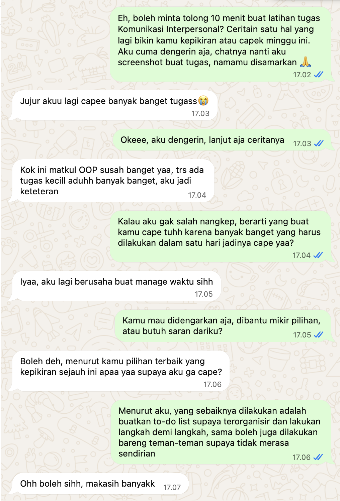

## Kompetensi target

Melakukan personal conversation dengan listening, clarity, boundary, dan relationship awareness.

## Evidence wajib

- Transcript atau catatan percakapan.
- Evidence listening dan response.
- Analisis relationship state sebelum dan sesudah.

## Konteks performance

**Tanggal dan setting:** Portofolio ini memuat dua sesi. **Sesi awal** dilakukan pada 22 September 2026 dalam latihan berpasangan mata kuliah Komunikasi Interpersonal dan Publik, berupa *roleplay* "Mendengarkan Tanpa Memperbaiki" (Bab 03) dengan peran bergantian. Portofolio ini mendokumentasikan sesi saat saya menjadi pendengar. **Sesi replay** dilakukan pada 7 Oktober 2026 melalui chat bersama seorang teman, untuk menindaklanjuti feedback dosen dan menguji apakah saya bisa mendengarkan tanpa buru-buru memberi solusi.

**Persons dan relationship:** Pada sesi awal, saya sebagai pendengar dan Mitra A sebagai pembicara. Kami adalah teman satu angkatan. Pada sesi replay, saya sebagai pendengar dan Mitra B, seorang teman, sebagai pembicara. Nama kedua mitra disamarkan untuk menjaga privasi.

**Objective dan initial state:** *State* awal pada sesi pertama: mitra bercerita tentang pengalamannya menjadi *project manager* Tugas Besar pembuatan *visual novel game*, saat beberapa anggota kurang berkontribusi sehingga ia harus ikut mengerjakan bagian mereka. Nada ceritanya menunjukkan rasa lelah dan kesal. Dari sisi saya, ada kecenderungan otomatis untuk langsung mencari solusi, sesuai pola yang saya tulis di Lembar Kerja Bab 01. *Objective*: membuat mitra merasa benar-benar didengarkan tanpa menghakimi dan tanpa memaksakan solusi, lalu menanyakan jenis bantuan yang ia butuhkan. Pada sesi replay, *objective* yang sama saya uji ulang dengan fokus tambahan: tidak memberi saran atau pertanyaan yang mengarah ke solusi sebelum *golden question*.

## Evidence

::: {.evidence-block}
### Sesi awal (22 September 2026)

**Potongan transcript (rekonstruksi dari catatan Lembar Kerja Bab 03):**

> **Mitra A:** "Aku pernah jadi PM buat Tugas Besar *visual novel game*. Susahnya itu ngatur dan mantau kerja tiap anggota. Ada beberapa yang kurang kontribusi, jadi ujung-ujungnya aku yang bantu ngerjain bagian mereka."  
> **Saya:** *(menyimak tanpa menyela, membiarkan mitra menyelesaikan ceritanya)*  
> **Saya:** "Kenapa nggak dilaporin ke dosen aja?"  
> **Mitra A:** *(menanggapi pertanyaan tersebut, lalu melanjutkan ceritanya)*  
> **Saya:** "Kalau aku nggak salah nangkep, yang bikin kamu kewalahan sebenarnya bukan cuma banyaknya kerjaan, tapi karena tanggung jawab kelompok jadi bertumpu di kamu. Kamu harus mantau semua orang, dan waktu ada yang kurang kontribusi, kamu yang nutupin bagian mereka. Bener begitu?"  
> **Mitra A:** "Iya, bener."  
> **Saya:** "Kamu mau didengarkan aja, dibantu memetakan pilihan, atau butuh saran?"  
> **Mitra A:** "Didengarkan aja. Tugasnya juga udah selesai, aku cuma pengen cerita."

**Artefak pendukung:** Lembar Kerja Bab 03, berisi catatan tiga tingkat mendengarkan, pilihan mitra atas *golden question*, umpan balik mitra, jurnal refleksi, dan rubrik evaluasi diri.

### Sesi replay (7 Oktober 2026)

**Transkrip lengkap chat:**

> **Saya (17.02):** "Eh, boleh minta tolong 10 menit buat latihan tugas Komunikasi Interpersonal? Ceritain satu hal yang lagi bikin kamu kepikiran atau capek minggu ini. Aku cuma dengerin aja, chatnya nanti aku screenshot buat tugas, namamu disamarkan 🙏"  
> **Mitra B (17.03):** "Jujur akuu lagi capee banyak banget tugass 😭"  
> **Saya (17.03):** "Okeee, aku dengerin, lanjut aja ceritanya"  
> **Mitra B (17.04):** "Kok ini matkul OOP susah banget yaa, trs ada tugas kecill aduhh banyak banget, aku jadi keteteran"  
> **Saya (17.04):** "Kalau aku gak salah nangkep, berarti yang buat kamu cape tuhh karena banyak banget yang harus dilakukan dalam satu hari jadinya cape yaa?"  
> **Mitra B (17.05):** "Iyaa, aku lagi berusaha buat manage waktu sihh"  
> **Saya (17.05):** "Kamu mau didengarkan aja, dibantu mikir pilihan, atau butuh saran dariku?"  
> **Mitra B (17.06):** "Boleh deh, menurut kamu pilihan terbaik yang kepikiran sejauh ini apaa yaa supaya aku ga cape?"  
> **Saya (17.06):** "Menurut aku, yang sebaiknya dilakukan adalah buatkan to-do list supaya terorganisir dan lakukan langkah demi langkah, sama boleh juga dilakukan bareng teman-teman supaya tidak merasa sendirian"  
> **Mitra B (17.07):** "Ohh boleh sihh, makasih banyakk"

**Apa yang ditunjukkan oleh bukti ini.** Sepanjang lima menit pertama percakapan, saya tidak memberi saran maupun pertanyaan yang mengarah ke solusi. Ketika Mitra B mulai mengeluh, saya hanya memberi tanda menyimak ("Okeee, aku dengerin, lanjut aja ceritanya"), lalu memparafrasa ceritanya dan memeriksa pemahaman saya dengan bertanya "…yaa?". *Golden question* saya ajukan pada pukul 17.05, dan saran baru saya berikan pada pukul 17.06, setelah Mitra B secara eksplisit meminta pendapat saya.

**Mengapa *repair* tidak muncul pada sesi ini.** Feedback dosen meminta *repair* eksplisit ketika pertanyaan yang mengarah ke solusi keluar. Pada sesi replay, pertanyaan atau saran semacam itu tidak muncul sebelum *golden question*, sehingga *repair* tidak diperlukan. Kalimat *repair* ("Maaf, tadi aku kebablasan langsung ke solusi. Lanjutkan ceritamu.") sudah saya siapkan sebelum sesi, tetapi tidak perlu digunakan. Menurut saya, hal ini menunjukkan adaptasi yang lebih mendasar: bukan hanya memperbaiki kesalahan setelah terjadi, tetapi mencegah dorongan otomatis untuk memperbaiki muncul sejak awal.

**Kekurangan yang saya temukan.** Pertama, saya melewatkan dua langkah, yaitu pertanyaan terbuka ("Bagian mana yang paling berat buatmu?") dan tebakan perasaan secara tentatif, dan langsung berpindah dari parafrasa ke *golden question*. Kedua, parafrasa saya menambahkan frasa "dalam satu hari", padahal Mitra B tidak menyebutkannya. Itu asumsi kecil yang seharusnya tidak saya masukkan. Ketiga, saya belum meminta umpan balik dari Mitra B di akhir sesi.

Kontribusi saya: berperan sebagai pendengar pada kedua sesi, melakukan parafrasa, mengajukan *golden question*, menahan saran sampai diminta, serta mendokumentasikan sesi replay dengan izin pembicara.
:::

## Relationship state sebelum dan sesudah

| Aspek | Sebelum percakapan | Sesudah percakapan |
|---|---|---|
| Keterbukaan mitra | Mitra A membawa cerita yang menyimpan rasa lelah dan kesal, belum tahu apakah akan didengar atau langsung diberi nasihat | Mitra A menyatakan dengan jelas bahwa ia hanya ingin didengarkan, dan merasa ceritanya diterima tanpa dipotong |
| Rasa aman | Ada risiko mitra merasa dinilai, karena ceritanya menyangkut kegagalan anggota tim yang ia pimpin | Mitra A cukup aman untuk memberi umpan balik jujur, termasuk menunjuk momen ketika saya mulai berasumsi |
| Posisi saya | Pendengar dengan dorongan otomatis untuk memperbaiki | Pendengar yang menyadari dorongan tersebut dan, pada sesi replay, mampu menahannya sampai pembicara meminta saran |

Perubahan paling penting pada sesi awal terlihat dari kesediaan Mitra A memberi kritik secara langsung. Pada sesi replay, perubahan terlihat dari respons Mitra B: ia menerima saran dengan terbuka ("Ohh boleh sihh, makasih banyakk") karena saran itu ia minta sendiri, bukan dipaksakan.

## Analisis komunikasi

| Elemen | Evidence dan analisis |
|---|---|
| Person & character | Mitra dilihat sebagai *person* yang lelah karena menanggung beban, bukan diberi label. Saya menjalankan *character* sahabat pendengar yang, sesuai peta karakter Minggu 1, memiliki risiko terlalu cepat memberi saran. Pada sesi awal, pengalaman Mitra A sebagai PM mirip dengan pengalaman saya sebagai Team Leader tim lomba (Minggu 1), sehingga pertanyaan "kenapa nggak dilaporin ke dosen aja?" kemungkinan muncul karena saya memproyeksikan cara saya sendiri. Pada sesi replay, cerita Mitra B tentang tugas yang menumpuk juga dekat dengan pengalaman saya, tetapi kali ini saya menahan diri dan membiarkan ia yang menentukan arah percakapan. |
| Objective & state | Ada dua *objective* yang saling bersaing dalam diri saya: *objective* yang disengaja (membuat mitra merasa didengar) dan *objective* otomatis (membantu dengan menawarkan jalan keluar). Pada sesi awal, *objective* otomatis sempat mengambil alih. Pada sesi replay, *objective* yang disengaja tetap memimpin sampai *golden question*, dan *objective* membantu baru dijalankan setelah pembicara memintanya. |
| Repertoire & language | Saya menggunakan tanda menyimak, parafrasa, dan *golden question* secara eksplisit di kedua sesi. Analisis sesi awal menunjukkan bahwa "kenapa nggak dilaporin ke dosen aja?" adalah pertanyaan tertutup yang berfungsi sebagai saran terselubung. Pada sesi replay, pola ini tidak muncul, tetapi saya melewatkan pertanyaan terbuka dan tebakan perasaan, serta menambahkan asumsi "dalam satu hari" pada parafrasa. Ini menunjukkan *repertoire* saya sudah lebih terkendali, tetapi belum lengkap. |
| Response & adaptation | Pada sesi awal, pertanyaan yang mengarah ke solusi muncul tanpa *repair*. Menindaklanjuti feedback dosen, saya melakukan sesi replay yang terdokumentasi dengan timestamp. Hasilnya, tidak ada saran atau pertanyaan solusi sebelum *golden question* (17.02–17.05), dan saran baru diberikan setelah Mitra B memintanya (17.06). Kalimat *repair* sudah disiapkan, tetapi tidak diperlukan karena dorongan memperbaiki berhasil ditahan sejak awal. |
| Agreement/action | Pada sesi awal, Mitra A memilih didengarkan saja dan saya menghormatinya dengan tidak memberi saran. Pada sesi replay, Mitra B meminta pendapat, sehingga saya memberi saran konkret (membuat *to-do list*, mengerjakan langkah demi langkah, dan mengerjakan bersama teman) yang ia terima. Kedua sesi menunjukkan bahwa jenis bantuan ditentukan oleh pembicara, bukan oleh saya. |
| Relationship outcome | Mitra A merasa saya hadir karena diberi waktu bercerita tanpa dipotong, dan cukup aman untuk memberi kritik jujur. Mitra B bersedia bercerita secara spontan tentang hal yang membuatnya lelah dan menerima saran dengan terbuka. Pada kedua sesi, hubungan tetap hangat karena pembicara tidak merasa dihakimi atau digurui. |

## Penggunaan AI

- **Alat dan peran AI:** Claude, untuk membantu menyusun struktur portofolio dari catatan Lembar Kerja Bab 03, menyiapkan skrip bagian pendengar untuk sesi replay, memperdalam analisis berdasarkan feedback dosen, dan merapikan kode Quarto.
- **Prompt atau instruksi penting:** Meminta bantuan mengisi template Minggu 3 berdasarkan Lembar Kerja Bab 03, menyiapkan alur sesi replay, lalu menyusun analisis dari tangkapan layar sesi replay.
- **Bagian output yang digunakan, diubah, atau ditolak:** Struktur analisis dan skrip bagian pendengar saya gunakan sebagai panduan. Jawaban pembicara pada sesi replay tidak diskenariokan dan berasal langsung dari Mitra B. Transcript sesi awal adalah rekonstruksi dari catatan Lembar Kerja Bab 03, sedangkan transkrip sesi replay disalin langsung dari tangkapan layar chat.
- **Pemeriksaan accuracy, privacy, dan authority:** Kedua sesi berasal dari percakapan nyata. Nama kedua mitra disamarkan. Kekurangan pada sesi replay (langkah yang terlewat dan asumsi pada parafrasa) saya identifikasi sendiri dan dicantumkan secara jujur.
- **Apa yang tetap saya pelajari sebagai manusia:** Menahan dorongan memberi saran saat seseorang bercerita, menyadari bahwa pertanyaan pun bisa berisi saran terselubung, dan merasakan langsung bahwa saran lebih mudah diterima ketika diminta, bukan ditawarkan sejak awal.

## Feedback dan tindak lanjut

**Feedback yang diterima:** Pada sesi awal, Mitra A merasa saya paling hadir ketika saya memberinya waktu untuk bercerita sepenuhnya tanpa memotong, tetapi juga menyampaikan bahwa saya mulai berasumsi dan ingin cepat memperbaiki ketika bertanya, "Kenapa nggak lapor ke dosen aja?" Dosen menilai bahwa *repair* eksplisit belum dilakukan dan meminta evidence perilaku dari sesi baru.

**Adaptation/replay:** Saya melakukan sesi replay melalui chat pada 7 Oktober 2026. Pada sesi ini, saya tidak memberi saran maupun pertanyaan yang mengarah ke solusi sebelum *golden question*, sehingga *repair* tidak diperlukan. Saran baru saya berikan setelah Mitra B memintanya, dan Mitra B menerimanya dengan terbuka. Seluruh sesi terdokumentasi dalam tangkapan layar ber-timestamp dan transkrip di bagian Evidence.

**Next practice:** Pada sesi mendengarkan berikutnya, saya akan menjalankan alur secara lengkap dengan tidak melewatkan pertanyaan terbuka dan tebakan perasaan sebelum *golden question*, menjaga parafrasa tetap sesuai kata-kata pembicara tanpa menambahkan asumsi, dan selalu meminta umpan balik dari pembicara di akhir sesi.

## Self-assessment

| Dimensi | Skor 1–4 | Evidence singkat |
|---|---:|---|
| Person & Character | 4 | Mitra dilihat sebagai *person*; pengaruh pengalaman saya sendiri sebagai pemimpin tim dianalisis di kedua sesi; dinamika *power* dalam sesi bergantian dikenali |
| Objective & State | 4 | *Objective* yang saling bersaing (mendengarkan vs memperbaiki) dianalisis dan dibandingkan antara sesi awal dan replay; *relationship state* dipetakan secara eksplisit |
| Repertoire, Language & AI | 3 | Tanda menyimak, parafrasa, dan *golden question* digunakan; pada replay, pertanyaan terbuka dan tebakan perasaan terlewat serta ada asumsi kecil pada parafrasa; batas AI dinyatakan jujur |
| Response & Adaptation | 4 | Sesi replay ber-timestamp menunjukkan tidak ada saran sebelum *golden question*; saran diberikan hanya setelah diminta; *repair* disiapkan tetapi tidak diperlukan |
| Agreement, Action & Relationship | 4 | Jenis bantuan ditentukan pembicara di kedua sesi; Mitra A memilih didengarkan, Mitra B meminta saran dan menerimanya dengan terbuka |

**Total:** 19 / 20

::: {.assessor-only}
### Assessment dosen

**Skor:** — / 20  
**Evidence yang mendukung:** —  
**Prioritas perbaikan:** —  
**Keputusan:** Belum dinilai / Perlu revisi / Tercapai
:::

