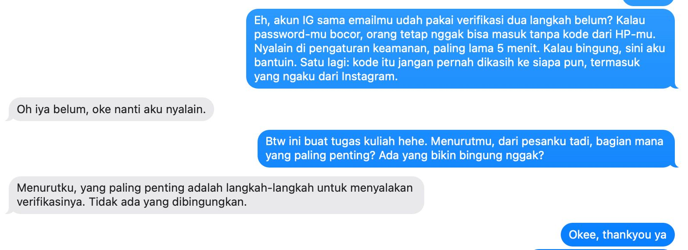

## Kompetensi target

Mengadaptasi repertoire dan language tanpa mengubah core meaning.

## Evidence wajib

- Lima versi untuk friend, technical peer, manager, customer, dan public.
- Alasan perubahan language dan repertoire.
- Feedback understanding dari sedikitnya satu target.

## Konteks performance

**Tanggal dan setting:** 24 September 2026. Penyusunan lima versi pesan dilakukan secara mandiri, lalu versi *friend* diuji langsung kepada satu teman dekat non-teknis melalui chat.

**Persons dan relationship:** Lima target dari peran-peran saya: teman dekat non-teknis (*friend*), rekan tim teknis Neurova (*technical peer*), rekan founder Neurova dari SBM ITB sebagai pengambil keputusan (*manager*), pengguna layanan Neurova (*customer*), dan masyarakat pengguna internet (*public*). Nama tidak dicantumkan.

**Objective dan initial state:** *State* awal: sebagai Cybersecurity Analyst, saya terbiasa menjelaskan keamanan akun dengan istilah teknis seperti TOTP, *credential stuffing*, atau SIM swap, sehingga orang non-teknis cenderung menganggapnya rumit dan menunda mengaktifkan 2FA. *Objective*: menyampaikan satu pesan yang sama ke lima target dengan *language* yang berbeda, sehingga setiap target paham alasannya dan tahu tindakan yang perlu diambil.

## Core meaning

Fakta yang tidak boleh berubah:

1. Kata sandi saja tidak cukup, karena kata sandi bisa bocor atau ditebak.
2. Autentikasi dua faktor (2FA) menambahkan satu lapis verifikasi, sehingga akun tetap aman meskipun kata sandi bocor.
3. Tindakan: aktifkan 2FA pada akun penting (email, perbankan, media sosial, akun kerja), utamakan aplikasi autentikator dibanding SMS, dan jangan pernah membagikan kode verifikasi kepada siapa pun.

## Evidence

::: {.evidence-block}
| Target/character | Versi language | Alasan adaptasi |
| :--- | :--- | :--- |
| **Friend** | "Eh, akun IG sama emailmu udah pakai verifikasi dua langkah belum? Kalau password-mu bocor, orang tetap nggak bisa masuk tanpa kode dari HP-mu. Nyalain di pengaturan keamanan, paling lama 5 menit. Kalau bingung, sini aku bantuin. Satu lagi: kode itu jangan pernah dikasih ke siapa pun, termasuk yang ngaku dari Instagram." | Santai, personal, pakai contoh akun yang ia pakai sehari-hari, menawarkan bantuan langsung, dan tanpa istilah teknis |
| **Technical peer** | "Semua akun kerja kita (Google Workspace, GitHub, dan dashboard hosting) wajib pakai 2FA. Utamakan TOTP lewat aplikasi autentikator atau *security key*, bukan SMS OTP yang rentan SIM swap. Simpan *recovery codes* di *password manager* tim, dan jangan pernah kirim kode OTP lewat chat, termasuk ke sesama anggota tim." | Menyebut metode, alasan teknis (SIM swap), dan langkah operasional yang spesifik untuk sesama orang teknis |
| **Manager** | "Saat ini akun kerja tim hanya dilindungi kata sandi. Kalau satu akun diambil alih, repositori kode dan data pengguna bisa ikut terbuka, dan kepercayaan pengguna yang paling mahal untuk dipulihkan. Saya usulkan 2FA diwajibkan untuk semua akun kerja mulai minggu depan. Biayanya nol dan setup-nya sekitar 10 menit per orang. Yang saya perlukan hanya persetujuan untuk menjadikannya aturan tim." | Menekankan dampak risiko, biaya, usulan, dan *decision point*, bukan mekanisme teknis |
| **Customer** | "Lindungi akun Neurova Anda dengan verifikasi dua langkah. Setelah diaktifkan, setiap kali masuk dari perangkat baru, Anda akan diminta memasukkan kode dari aplikasi autentikator di ponsel Anda. Aktifkan melalui menu Pengaturan > Keamanan. Tim Neurova tidak akan pernah meminta kode verifikasi Anda." | Formal dan sopan, fokus pada manfaat dan langkah yang harus dilakukan pengguna, disertai peringatan anti-penipuan |
| **Public** | "Kata sandi saja tidak cukup untuk menjaga akun Anda. Aktifkan verifikasi dua langkah di email, mobile banking, dan media sosial. Dengan begitu, meskipun kata sandi Anda bocor, akun tetap tidak bisa dibuka tanpa kode dari ponsel Anda. Ingat: jangan berikan kode verifikasi kepada siapa pun, termasuk yang mengaku petugas bank atau aplikasi." | Kalimat pendek, tanpa jargon, contoh akun yang dimiliki banyak orang, dan satu pesan pengaman yang mudah diingat |

*Catatan:* Versi *customer* adalah draf notifikasi untuk rencana fitur keamanan akun Neurova, bukan pengumuman yang sudah dipublikasikan.

**Uji pemahaman:**

Versi *friend* saya kirim kepada satu teman dekat non-teknis tanpa penjelasan tambahan. Target menjawab, "Oh iya belum, oke nanti aku nyalain." Ketika saya bertanya bagian mana yang paling penting dan apakah ada yang membingungkan, target menjawab, "Menurutku, yang paling penting adalah langkah-langkah untuk menyalakan verifikasinya. Tidak ada yang dibingungkan."

**Versi *friend* setelah adaptasi:**

> "Eh, akun IG sama emailmu udah pakai verifikasi dua langkah belum? Kalau password-mu bocor, orang tetap nggak bisa masuk tanpa kode dari HP-mu.
>
> Cara nyalain di IG: buka Profil > menu garis tiga > Pusat Akun > Kata sandi dan keamanan > Autentikasi dua faktor. Kalau ada pilihan, pakai aplikasi autentikator ya, lebih aman daripada kode SMS. Paling lama 5 menit, kalau bingung sini aku bantuin.
>
> ⚠️ Yang paling penting: kode itu jangan pernah dikasih ke siapa pun, termasuk yang ngaku dari Instagram."

Kontribusi saya: menentukan *core meaning*, memilih lima target dari peran saya sendiri, memeriksa ketepatan teknis setiap versi, menguji versi *friend* kepada satu target, dan memperbaiki versi tersebut berdasarkan responsnya.
:::

## Analisis komunikasi

| Elemen | Evidence dan analisis |
|---|---|
| Person & character | Kelima target dibedakan berdasarkan kebutuhan, bukan stereotipe. Teman butuh kemudahan dan bantuan, rekan teknis butuh prosedur yang presisi, *manager* butuh dampak dan keputusan, *customer* butuh langkah yang jelas dan rasa aman, sedangkan publik butuh pesan singkat yang mudah diingat. Saya juga berganti *character*: sahabat, CTO, rekan founder, penyedia layanan, dan praktisi keamanan siber. |
| Objective & state | *Core meaning* dijaga di kelima versi: kata sandi tidak cukup, 2FA menambah lapis perlindungan, aktifkan pada akun penting, dan jangan bagikan kode. Uji pemahaman menunjukkan versi *friend* berhasil mendorong niat bertindak ("nanti aku nyalain"), tetapi juga memperlihatkan bahwa poin "utamakan aplikasi autentikator" belum tersampaikan di versi tersebut. |
| Repertoire & language | *Repertoire* berubah dari ajakan personal, instruksi teknis, *decision brief*, instruksi layanan, hingga imbauan publik. Istilah teknis (TOTP, SIM swap, *recovery codes*) hanya muncul pada versi *technical peer*. Pada versi lain, istilah itu diganti menjadi "kode dari HP" atau "verifikasi dua langkah". |
| Response & adaptation | Target menilai bagian terpenting adalah "langkah-langkah untuk menyalakan verifikasinya", padahal versi awal hanya menyebut "nyalain di pengaturan keamanan" tanpa langkah konkret. Target juga tidak menyebut peringatan untuk tidak membagikan kode, yang menunjukkan peringatan itu kurang menonjol karena diletakkan di akhir. Karena itu, versi *friend* saya perbaiki dengan menambahkan urutan langkah di Instagram, anjuran memakai aplikasi autentikator, dan menandai peringatan kode sebagai bagian yang paling penting. |
| Agreement/action | Setiap versi diakhiri tindakan yang jelas: dibantu mengaktifkan (*friend*), aturan akun kerja (*technical peer*), persetujuan kebijakan (*manager*), menu yang harus dibuka (*customer*), dan satu kebiasaan aman (*public*). Target versi *friend* menyatakan akan mengaktifkan verifikasi dua langkah. |
| Relationship outcome | Versi *friend* dan *public* dibuat tanpa menakut-nakuti atau menggurui, sehingga target tidak merasa dianggap ceroboh. Target merespons dengan santai dan terbuka menjawab pertanyaan lanjutan. Versi *manager* menjaga hubungan kerja dengan memberi usulan yang siap diputuskan, bukan tuntutan sepihak. |

## Penggunaan AI

- **Alat dan peran AI:** Claude, untuk membantu menyusun draf awal lima versi pesan dan struktur portofolio.
- **Prompt atau instruksi penting:** Meminta bantuan mengisi template Minggu 4 dengan topik yang sesuai peran saya sebagai Cybersecurity Analyst dan CTO Neurova, mengikuti format contoh dosen.
- **Bagian output yang digunakan, diubah, atau ditolak:** Draf lima versi saya gunakan sebagai dasar, dan versi *friend* saya uji kepada teman tanpa perubahan. Setelah menerima respons teman, versi *friend* diperbaiki dengan menambahkan langkah konkret, anjuran aplikasi autentikator, dan penekanan pada peringatan kode.
- **Pemeriksaan accuracy, privacy, dan authority:** Ketepatan teknis (kelemahan SMS OTP terhadap SIM swap, keunggulan aplikasi autentikator, dan larangan membagikan kode) saya periksa berdasarkan pengetahuan saya sebagai Cybersecurity Analyst. Tidak ada data internal Neurova atau data pribadi target yang dimasukkan ke AI, dan identitas teman yang menjadi target uji tidak dicantumkan.
- **Apa yang tetap saya pelajari sebagai manusia:** Menguji pesan langsung kepada orang yang saya kenal dan membaca responsnya. Respons teman menunjukkan hal yang tidak saya sadari saat menulis, yaitu bahwa ia paling membutuhkan langkah konkret, bukan sekadar alasan.

## Feedback dan tindak lanjut

**Feedback yang diterima:** Target versi *friend* menyatakan, "Oh iya belum, oke nanti aku nyalain." Saat ditanya bagian terpenting, ia menjawab, "Menurutku, yang paling penting adalah langkah-langkah untuk menyalakan verifikasinya. Tidak ada yang dibingungkan."

**Adaptation/replay:** Versi *friend* diperbaiki dengan menambahkan urutan langkah mengaktifkan autentikasi dua faktor di Instagram, anjuran memilih aplikasi autentikator dibanding SMS agar sesuai dengan *core meaning*, serta menempatkan peringatan "jangan berikan kode kepada siapa pun" sebagai poin yang ditandai paling penting. Versi perbaikan ini belum diuji ulang kepada target.

**Next practice:** Mengirim versi *friend* yang sudah diperbaiki kepada target yang sama untuk memeriksa apakah langkahnya mudah diikuti dan peringatan kodenya kini tertangkap. Selain itu, setiap kali menjelaskan topik keamanan siber kepada orang non-teknis, saya akan menyertakan minimal satu langkah konkret yang bisa langsung dilakukan, lalu menanyakan, "Bagian mana yang paling kamu ingat?"

## Self-assessment

| Dimensi | Skor 1–4 | Evidence singkat |
|---|---:|---|
| Person & Character | 3 | Lima target dibedakan berdasarkan kebutuhan dan peran saya terhadap masing-masing |
| Objective & State | 3 | *Core meaning* konsisten; uji pemahaman mengungkap satu poin yang belum tersampaikan di versi *friend* |
| Repertoire, Language & AI | 3 | Lima *repertoire* dengan alasan adaptasi; batas AI dinyatakan |
| Response & Adaptation | 3 | Respons target menghasilkan perbaikan konkret: langkah aktivasi, anjuran aplikasi autentikator, dan penekanan peringatan |
| Agreement, Action & Relationship | 3 | Setiap versi memiliki tindakan eksplisit; target menyatakan akan mengaktifkan 2FA |

**Total:** 15 / 20

::: {.assessor-only}
### Assessment dosen

**Skor:** — / 20  
**Evidence yang mendukung:** —  
**Prioritas perbaikan:** —  
**Keputusan:** Belum dinilai / Perlu revisi / Tercapai
:::

