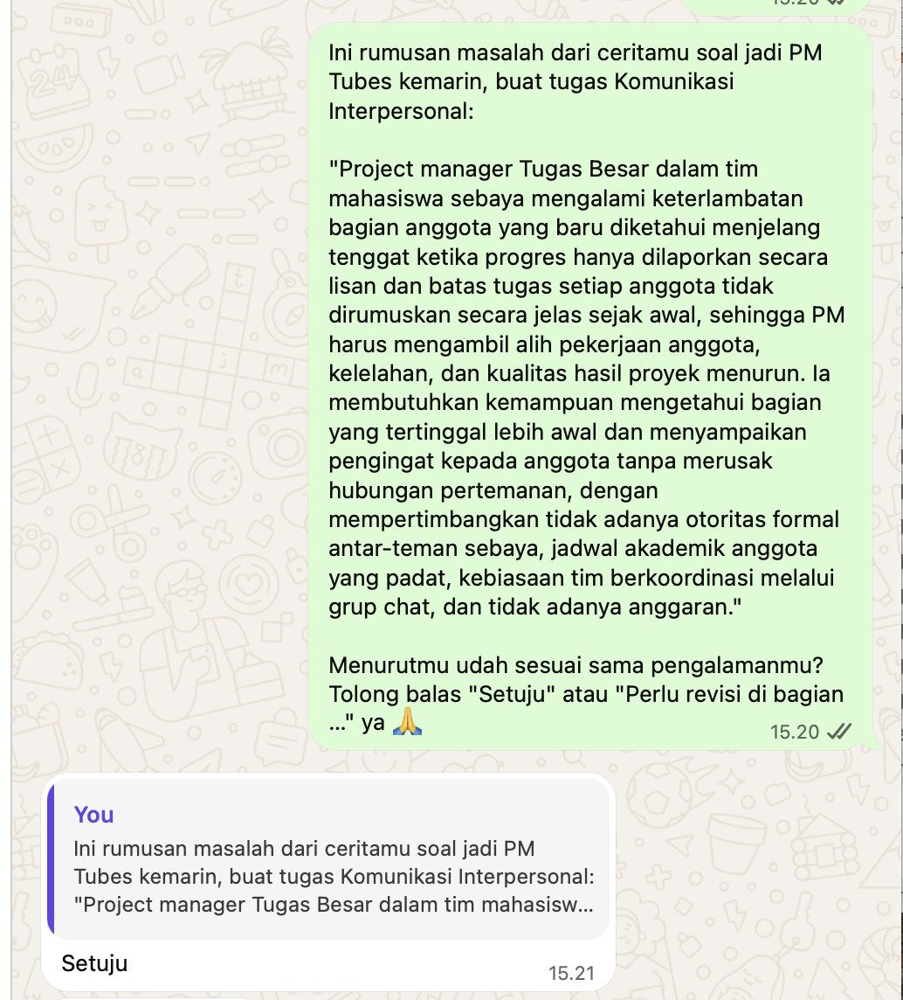

## Kompetensi target

Mendengar sebelum proposing dan membangun shared problem statement dengan person.

## Evidence wajib

- Initial assumption dan pertanyaan discovery.
- Transcript/paraphrase serta problem impact dan constraint.
- Shared problem statement yang dikonfirmasi partner.

## Konteks performance

**Tanggal dan setting:** September–Oktober 2026. Wawancara penemuan kebutuhan dilakukan dalam bentuk simulasi atas izin dosen, berdasarkan pengalaman nyata Mitra A yang ia ceritakan pada latihan mendengarkan Bab 03 (22 September 2026), dan dengan persetujuan Mitra A untuk menggunakan ceritanya. *Shared problem statement* kemudian dikonfirmasi langsung oleh Mitra A melalui chat pada 7 Oktober 2026.

**Persons dan relationship:** Saya sebagai pewawancara dan Mitra A sebagai narasumber. Mitra A adalah rekan mahasiswa satu angkatan yang pernah menjadi *project manager* Tugas Besar pembuatan *visual novel game* dalam tim multidisiplin. Nama narasumber disamarkan.

**Objective dan initial state:** *Initial state*: saya berasumsi masalah utamanya adalah **anggota kelompok yang malas**, sehingga yang dibutuhkan adalah alat untuk memantau dan menagih progres setiap anggota. Asumsi ini muncul dari kecenderungan saya yang cepat menyiapkan solusi, seperti yang terlihat di Lembar Kerja Bab 03. *Objective*: menahan diri dari mengusulkan solusi, menggali masalah yang sebenarnya melalui lima pertanyaan penemuan, dan merumuskan *shared problem statement* yang disetujui narasumber.

## Evidence

::: {.evidence-block}
**Pertanyaan discovery dan fungsinya:**

| No | Pertanyaan | Fungsi | Yang sengaja dihindari |
| :---: | :--- | :--- | :--- |
| 1 | "Coba ceritakan satu kejadian konkret waktu ada anggota yang kurang berkontribusi. Waktu itu apa yang terjadi?" | Mendapat fakta dari kejadian nyata, bukan opini umum | "Kenapa anggotamu malas?" (sudah memuat label) |
| 2 | "Dampaknya ke kamu apa, misalnya ke waktu, nilai, atau perasaanmu?" | Mengukur beban nyata: waktu, kualitas kerja, dan emosi | "Pasti capek banget ya?" (menebak perasaan sebelum ia bercerita) |
| 3 | "Selain kamu, siapa lagi yang kena dampaknya?" | Memetakan pihak terdampak di luar narasumber | Hanya berfokus pada PM sebagai korban |
| 4 | "Kalau suatu saat kamu jadi PM lagi, keadaan ideal yang kamu harapkan itu seperti apa?" | Merumuskan hasil yang diinginkan, bukan fitur | "Kalau ada aplikasi buat pantau progres, mau pakai?" (pertanyaan yang menggiring ke solusi) |
| 5 | "Apa yang bikin masalah ini susah diatasi?" | Menemukan *constraint* nyata | Langsung menawarkan cara mengatasinya |

**Potongan transcript dan parafrasa:**

> **Mitra A:** "Mendekati deadline aku baru tahu beberapa aset sama bagian naskah belum dikerjain. Selama ini progresnya cuma dilaporin lisan, 'aman, lagi dikerjain', jadi aku baru sadar pas semuanya mau digabung."  
> **Saya:** "Jadi masalahnya bukan cuma ada yang nggak ngerjain, tapi kamu baru tahu ada yang tertinggal di akhir karena progresnya nggak kelihatan, betul?"  
> **Mitra A:** "Iya, betul. Akhirnya aku begadang beberapa malam buat bantu ngerjain bagian mereka, tugas lain jadi ketunda, dan beberapa bagian game hasilnya kurang bagus karena buru-buru."  
> **Saya:** "Kalau jadi PM lagi, apa yang nggak boleh hilang dari cara kerja tim?"  
> **Mitra A:** "Kita semua temen, jadi aku sungkan negur. Terus jangan sampai harus pakai aplikasi baru yang ribet, kita udah biasa koordinasi lewat grup chat, dan nggak ada budget buat tools berbayar."

**Dampak dan pihak terdampak:** PM kelelahan dan tugas lainnya tertunda. Anggota yang sudah menyelesaikan bagiannya merasa kontribusinya tidak sebanding. Programmer integrasi tertekan karena waktu penggabungan menyempit. Nilai kelompok sebagai hasil bersama ikut dipertaruhkan.

**Constraint:** Tidak ada otoritas formal antar-teman sebaya, jadwal akademik anggota padat, tim terbiasa berkoordinasi lewat grup chat, dan tidak ada anggaran.

**Pelacakan asumsi:**

| Asumsi awal saya | Temuan dari wawancara | Evidence yang mengubahnya |
| :--- | :--- | :--- |
| Anggota malas | Sebagian anggota tidak tahu persis batas tugasnya | Koreksi Mitra A terhadap kata "malas" |
| Masalahnya adalah anggota tidak mengerjakan | Masalahnya adalah keterlambatan baru terlihat di akhir | "Progresnya cuma dilaporin lisan… aku baru sadar pas semuanya mau digabung" |
| Butuh cara menagih progres | Butuh cara mengetahui lebih awal dan mengingatkan tanpa merusak hubungan | "Kita semua temen, jadi aku sungkan negur" |
| Solusi bisa berupa aplikasi pemantau | Tim menolak alat baru yang rumit dan tidak punya anggaran | "Jangan sampai harus pakai aplikasi baru yang ribet… nggak ada budget" |

**Pembaruan pembacaan:** Asumsi awal "anggota malas" tidak didukung. Wawancara menunjukkan tiga kemungkinan masalah: progres yang tidak terlihat sampai menjelang tenggat, batas tugas yang tidak dirumuskan jelas sejak awal, dan rasa sungkan menegur teman sebaya. Karena wawancara ini berbentuk simulasi dengan satu narasumber, temuan ini saya tandai sebagai *discovery* awal.

**Evolusi problem statement:**

- *Draf awal:* "*Project manager* Tugas Besar mengalami anggota kelompok yang malas dan tidak mengerjakan bagiannya ketika proyek mendekati tenggat, sehingga PM harus mengerjakan bagian anggota tersebut. Ia membutuhkan cara untuk memantau dan menagih progres setiap anggota, dengan mempertimbangkan jadwal kuliah anggota yang padat."
- *Koreksi narasumber:* Mitra A tidak setuju dengan kata "malas", karena sebagian anggota sebenarnya tidak tahu persis batas tugasnya. Masalahnya juga bukan sekadar "menagih", tetapi mengetahui keterlambatan lebih awal dan mengingatkan teman tanpa merusak hubungan.

**Shared problem statement:**

> *Project manager* Tugas Besar dalam tim mahasiswa sebaya mengalami keterlambatan bagian anggota yang baru diketahui menjelang tenggat ketika progres hanya dilaporkan secara lisan dan batas tugas setiap anggota tidak dirumuskan secara jelas sejak awal, sehingga PM harus mengambil alih pekerjaan anggota, kelelahan, dan kualitas hasil proyek menurun. Ia membutuhkan kemampuan mengetahui bagian yang tertinggal lebih awal dan menyampaikan pengingat kepada anggota tanpa merusak hubungan pertemanan, dengan mempertimbangkan tidak adanya otoritas formal antar-teman sebaya, jadwal akademik anggota yang padat, kebiasaan tim berkoordinasi melalui grup chat, dan tidak adanya anggaran.

**Konfirmasi langsung dari mitra:**

**Apa yang ditunjukkan oleh bukti ini.** Tangkapan layar di atas memperlihatkan dua pesan. Pesan pertama (pukul 15.20) adalah pesan saya kepada Mitra A yang berisi *shared problem statement* versi final secara utuh, kata per kata sama dengan rumusan di atas. Di akhir pesan, saya meminta Mitra A memilih salah satu dari dua jawaban eksplisit: *"Setuju"* atau *"Perlu revisi di bagian …"*. Pesan kedua (pukul 15.21) adalah balasan Mitra A yang mengutip langsung pesan rumusan tersebut dan menjawab **"Setuju"**.

**Mengapa cara konfirmasi ini dipilih.** Saya sengaja mengirim rumusan secara lengkap, bukan ringkasan, agar Mitra A menilai kalimat yang sama persis dengan yang dicantumkan di portofolio. Saya juga memberikan dua pilihan jawaban yang jelas supaya Mitra A tidak merasa sungkan untuk tidak setuju. Dalam relasi teman sebaya, pertanyaan seperti "udah oke kan?" cenderung mendorong jawaban "iya" demi menjaga perasaan, sedangkan pilihan "Perlu revisi di bagian …" memberi ruang aman untuk mengoreksi.

**Apa artinya bagi rumusan masalah.** Balasan "Setuju" menunjukkan bahwa rumusan akhir, termasuk penghapusan label "malas" dan penambahan *constraint* relasi pertemanan, sudah mewakili pengalaman Mitra A, bukan sekadar interpretasi saya. Karena balasan tersebut mengutip langsung pesan rumusan, persetujuannya jelas merujuk pada rumusan yang dimaksud, bukan pada pesan lain di percakapan.

**Hubungannya dengan proses discovery.** Konfirmasi ini menutup siklus *discovery*: dimulai dari asumsi awal saya ("anggota malas"), diperbaiki melalui koreksi narasumber dalam wawancara, lalu diverifikasi kembali kepada orang yang benar-benar mengalaminya. Dengan begitu, *shared problem statement* ini benar-benar milik bersama, bukan hasil sepihak dari pewawancara.

**Artefak pendukung:** Lembar Kerja Bab 05, berisi log lengkap lima pertanyaan penemuan, Draft 1 dan Draft 2 rumusan masalah, refleksi, dan rubrik evaluasi diri.

Kontribusi saya: menyusun pertanyaan discovery, melakukan parafrasa, melacak dan memperbarui asumsi, merumuskan dan merevisi *problem statement*, serta meminta dan mendokumentasikan konfirmasi langsung dari Mitra A.
:::

## Analisis komunikasi

| Elemen | Evidence dan analisis |
|---|---|
| Person & character | Mitra A dipetakan sebagai *person* dengan pengalaman, beban, dan relasi pertemanan yang ingin ia jaga, bukan sekadar "pengguna yang butuh fitur". Saya berganti *character* dari sahabat pendengar (Bab 03) menjadi pewawancara profesional yang tugasnya memahami masalah sebelum mengusulkan apa pun. Ada dua dinamika yang perlu saya jaga. Pertama, sebagai sesama teman sebaya, *power* kami setara, sehingga saya harus menjaga agar wawancara tetap terarah tanpa terasa seperti interogasi. Kedua, cerita Mitra A menyangkut anggota timnya yang tidak hadir untuk membela diri, sehingga label seperti "malas" berisiko merugikan pihak ketiga. Saya juga menyadari bias pribadi: pengalaman saya sebagai Team Leader dengan masalah serupa (Minggu 1) membuat saya mudah memproyeksikan solusi saya sendiri ke situasi Mitra A. |
| Objective & state | Ada *objective* yang saling bersaing. Sebagai mahasiswa STI yang terbiasa membangun produk, dorongan otomatis saya adalah segera merancang alat pemantau progres. Mitra A memiliki *objective* berbeda, yaitu agar masalahnya dipahami tanpa menyalahkan anggota timnya. *State* berubah dari asumsi "anggota malas, butuh alat penagih progres" menjadi rumusan masalah yang berpusat pada visibilitas progres, kejelasan batas tugas, dan relasi antar-teman sebaya. Pergeseran ini terdokumentasi lengkap dalam tabel pelacakan asumsi. |
| Repertoire & language | Setiap pertanyaan discovery memiliki fungsi yang jelas (fakta, dampak, pihak terdampak, hasil ideal, dan *constraint*), dan setiap pertanyaan dirancang untuk menghindari bentuk yang menggiring, seperti label, tebakan perasaan, atau tawaran solusi terselubung. Parafrasa digunakan untuk memeriksa pemahaman sebelum melangkah ke topik berikutnya. Permintaan konfirmasi juga dirumuskan secara eksplisit dengan dua pilihan jawaban ("Setuju" atau "Perlu revisi di bagian …"), sehingga mitra mudah menyatakan persetujuan maupun keberatan. Rumusan akhir tidak menyebut solusi teknis apa pun. Status simulasi dinyatakan secara terbuka. |
| Response & adaptation | Koreksi Mitra A mengubah tiga unsur rumusan masalah sekaligus: label ("anggota malas" menjadi keadaan yang dapat diamati), kebutuhan ("menagih" menjadi "mengetahui lebih awal dan mengingatkan tanpa merusak hubungan"), dan *constraint* (relasi pertemanan serta kebiasaan koordinasi lewat grup chat). Saya juga menahan diri untuk tidak menawarkan aplikasi setelah mendengar *constraint* bahwa tim menolak alat baru yang rumit. Setelah menerima feedback dosen bahwa konfirmasi belum dilakukan, saya langsung melakukan konfirmasi sebelum tenggat yang saya tetapkan sendiri. |
| Agreement/action | *Shared problem statement* dikonfirmasi langsung oleh Mitra A melalui chat pada 7 Oktober 2026. Rumusan final dikirim pukul 15.20 dengan permintaan balasan eksplisit, dan Mitra A menjawab "Setuju" pukul 15.21 dengan mengutip pesan rumusan tersebut. Konfirmasi ini dilakukan sebelum tenggat 9 Oktober 2026 yang saya tetapkan. |
| Relationship outcome | Mitra A bersedia ceritanya digunakan untuk latihan ini dan merespons permintaan konfirmasi dengan cepat, yang menunjukkan kepercayaan terhadap cara saya merumuskan pengalamannya. Dengan menghapus label "malas", rumusan masalah menghormati anggota tim Mitra A yang tidak hadir dalam percakapan, dan persetujuan eksplisit Mitra A memastikan rumusan tersebut benar-benar mewakili pengalamannya, bukan interpretasi sepihak saya. |

## Penggunaan AI

- **Alat dan peran AI:** Claude, untuk membantu menyusun skenario wawancara simulasi berdasarkan cerita Mitra A, menyusun struktur portofolio dan tabel analisis, menyiapkan pesan permintaan konfirmasi, serta merapikan kode Quarto.
- **Prompt atau instruksi penting:** Meminta bantuan membuat wawancara simulasi (atas izin dosen) dari masalah yang diceritakan Mitra A pada Bab 03, mengisi template Minggu 5 secara konsisten dengan Lembar Kerja Bab 05, memperdalam analisis tanpa menambahkan kejadian baru, dan merevisi portofolio berdasarkan feedback dosen.
- **Bagian output yang digunakan, diubah, atau ditolak:** Struktur lima pertanyaan penemuan, log wawancara, formula *problem statement*, dan tabel pelacakan asumsi saya gunakan. Keterangan bahwa wawancara ini berbentuk simulasi tetap saya cantumkan agar tidak dianggap wawancara langsung. Konfirmasi rumusan saya lakukan sendiri secara langsung kepada Mitra A, dan tangkapan layarnya dilampirkan sebagai evidence.
- **Pemeriksaan accuracy, privacy, dan authority:** Masalah inti diambil dari cerita nyata Mitra A di Bab 03, dan rumusan akhirnya telah disetujui langsung oleh Mitra A. Nama narasumber disamarkan dan tidak ada data pribadi yang dicantumkan.
- **Apa yang tetap saya pelajari sebagai manusia:** Menyadari bias saya yang cepat melabeli dan menyiapkan solusi, serta tanggung jawab untuk memeriksa kembali rumusan masalah kepada orang yang benar-benar mengalaminya.

## Feedback dan tindak lanjut

**Feedback yang diterima:** Koreksi Mitra A terhadap Draft 1: label "malas" tidak tepat karena sebagian anggota tidak tahu batas tugasnya, dan kebutuhan utamanya adalah mengetahui keterlambatan lebih awal serta mengingatkan teman tanpa merusak hubungan, bukan sekadar menagih. Dosen juga menilai bahwa *shared problem statement* perlu dikonfirmasi langsung oleh mitra dengan bukti yang terdokumentasi.

**Adaptation/replay:** Rumusan masalah direvisi dengan mengganti label "anggota malas" menjadi deskripsi keadaan yang dapat diamati (progres dilaporkan lisan, batas tugas tidak jelas), mengganti kebutuhan "memantau dan menagih" menjadi "mengetahui lebih awal dan mengingatkan tanpa merusak hubungan", serta menambahkan constraint relasi pertemanan dan kebiasaan koordinasi lewat grup chat. Menindaklanjuti feedback dosen, saya mengirim rumusan final kepada Mitra A dengan permintaan balasan eksplisit, dan Mitra A menyetujuinya pada 7 Oktober 2026.

**Next practice:** Pada wawancara discovery berikutnya, saya akan melakukannya secara langsung dengan narasumber, menanyakan *current workaround* sebelum menyebut kemungkinan solusi apa pun, dan langsung mengonfirmasi *problem statement* di akhir sesi yang sama, bukan menundanya ke hari lain.

## Self-assessment

| Dimensi | Skor 1–4 | Evidence singkat |
|---|---:|---|
| Person & Character | 4 | Narasumber dipetakan sebagai *person*; dinamika *power* antar-teman sebaya, risiko terhadap pihak ketiga yang tidak hadir, dan bias pribadi saya sebagai Team Leader dianalisis |
| Objective & State | 4 | *Objective* yang saling bersaing (dorongan membangun solusi vs kebutuhan narasumber agar tim tidak disalahkan) dianalisis; perubahan asumsi terdokumentasi dalam tabel pelacakan |
| Repertoire, Language & AI | 4 | Fungsi setiap pertanyaan dan bentuk pertanyaan menggiring yang dihindari dijelaskan; permintaan konfirmasi dirumuskan eksplisit; *problem statement* bebas solusi; status simulasi dan penggunaan AI dinyatakan |
| Response & Adaptation | 4 | Koreksi narasumber mengubah tiga unsur rumusan sekaligus; feedback dosen langsung ditindaklanjuti dengan konfirmasi sebelum tenggat |
| Agreement, Action & Relationship | 4 | *Shared problem statement* dikonfirmasi langsung oleh Mitra A ("Setuju", 7 Oktober 2026 pukul 15.21) dengan bukti tangkapan layar ber-timestamp |

**Total:** 20 / 20

::: {.assessor-only}
### Assessment dosen

**Skor:** — / 20  
**Evidence yang mendukung:** —  
**Prioritas perbaikan:** —  
**Keputusan:** Belum dinilai / Perlu revisi / Tercapai
:::

